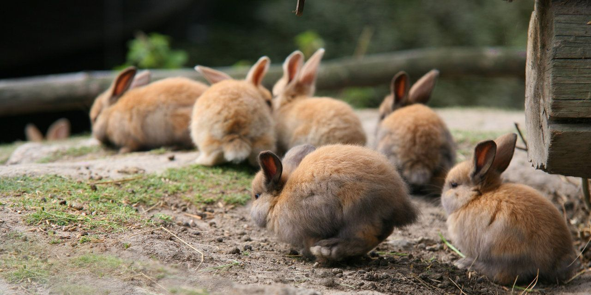

# Project Bunny

This is a self-made light blog framework, made of AngularDart and Bulma.

There are greate blog frameworks like Jekyll, but they offers too much so that config is a little bit complex. My requirement is quite simple, and I wanna use dart, so project bunny is here.

## Usage